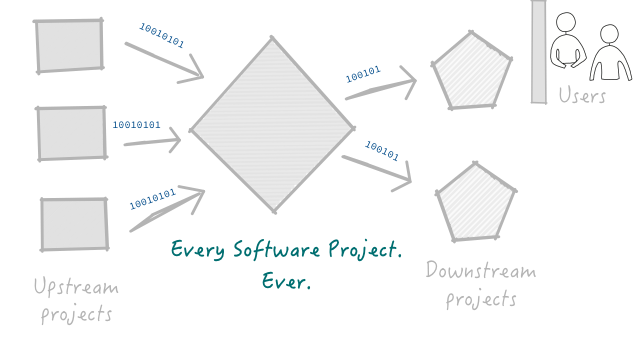

## Software Engineering
### Consume, Process & Produce Bits

- Bits appear in various shapes and forms but its all bits.
- Libraries, Documentation, Compilers, Browsers, Containers, Apps, etc.
- We get annoyed when upstream projects change their bits without telling us.

### Good projects are better at managing the bits they produce.

---

## Delivering ✨bits
### What is common between your favorite upstream projects?

- All good projects deliver useful, high quality, well documented, software (bits). 

### What else? 

1. Consistent versioning scheme ([semantic] or [sentimental])
2. Predictable delivery [channels] (e.g. `beta`, `stable`, `nightly`, `snapshot`, etc.)
3. Predictable cadence on release channels (e.g. `beta` every month, security fixes on `stable`)
4. Diligent record of upcoming and released [changes].

### How do these help?

The channels and cadence help you plan **when** to expect changes, the version tells you **how** big
the changes will be and the change log tells you exactly **what** will or has changed.

[semantic]: https://semver.org
[changes]: http://keepachangelog.com/en/1.0.0/
[channels]: https://doc.rust-lang.org/book/first-edition/release-channels.html
[sentimental]: http://sentimentalversioning.org

---

## 4. Diligent record of changes
### Diligent = Accurate & Pretty 

- **Accurate** - the change log remains accurate when it is maintained:
 - close to the *source* (i.e. git repository, not some distant wiki etc.)
 - incrementally and regularly (i.e. not once on the day of release.)
 - inline with the developer contribution workflow (e.g. at `git commit`)

- **Pretty** - the change log can pretty when we:
 - decouple recording changes from reporting
 - use light-weight markup language (Markdown)

- **Examples**
 - [Github Desktop Release Notes](https://desktop.github.com/release-notes/)

---
