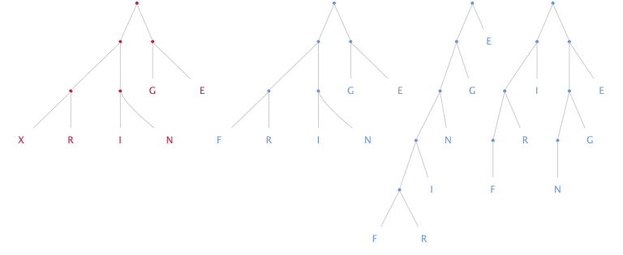

## Code

Here <i style="color:#fee" class="far fa-hand-point-down"></i> is some code.

```rust
// Copyright 2017 Aldrin J D'Souza.
// Licensed under the MIT License <https://opensource.org/licenses/MIT>

extern crate nicely;

fn main() {
    nicely::done();
}
```

---

## Lists

### Simple lists
- One two three four,
- five six seven eight nine,
- ten eleven twelve thirteen,
- fourteen, fifteen, sixteen.

### Fancy lists

Straight HTML works.

<ul class="fa-ul">
<li><i class="far fa-hand-point-right"></i>
List icons
</li>
<li><i class="far fa-hand-point-right"></i> can be used</li>
</ul>

---

## Images

To use an image, put it `images` directory,



and link to it as ``.

---

## Walls of Text

Blockquotes 

<blockquote class="blockquote">
Ineluctable modality of the visible: at least that if no more, thought through my eyes. Signatures
of all things I am here to read, seaspawn and seawrack, the nearing tide, that rusty boot.
</blockquote>

Universally that person's acumen is esteemed very little perceptive concerning whatsoever matters
are being held as most profitably by mortals with sapience endowed to be studied who is ignorant of
that which the most in doctrine erudite and certainly by reason of that in them high mind's ornament
deserving of veneration constantly maintain when by general consent they affirm that other
circumstances being equal by no exterior splendour is the prosperity of a nation more efficaciously
asserted than by the measure of how far forward may have progressed the tribute of its solicitude
for that proliferent continuance which of evils the original if it be absent when fortunately
present constitutes the certain sign of omnipotent nature's incorrupted benefaction.

---

## A Table

| Apples | Oranges | Bananas |
|--------|---------|---------|
|      1 |      10 |      11 |
|     10 |      11 |      21 |
|        |         |     100 |
|     10 |         |         |
Fruits
